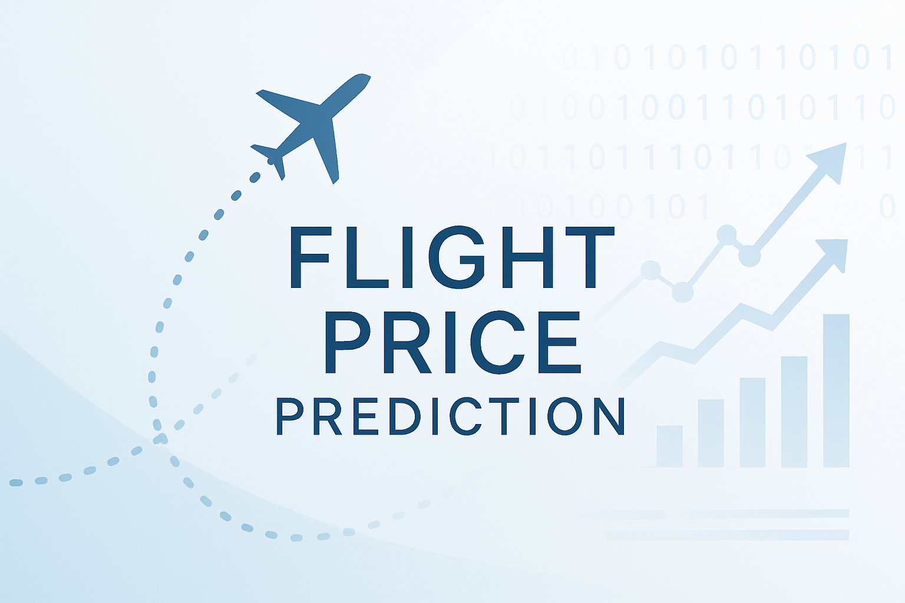

<p align="center">
  
</p>

# ✈️ Flight Price Prediction

A machine learning project aimed at predicting flight ticket prices based on various features such as airline, source, destination, departure and arrival times, duration, and number of stops. This project involves data preprocessing, exploratory data analysis (EDA), feature engineering, and model training using regression algorithms.

## 📁 Project Structure

```
Flight-Price-Prediction/
├── assets/
    └── cover.png
├── catboost_info
├── Clean_Dataset.csv
├── Project.ipynb
├── README.md
```


## 📊 Dataset

- **Source**: [Kaggle - Flight Price Prediction Dataset](https://www.kaggle.com/datasets/shubhambathwal/flight-price-prediction)
- **Description**: The dataset contains information about flight bookings, including features like airline, source, destination, route, departure and arrival times, duration, total stops, and price.

## 🛠️ Technologies Used

- **Programming Language**: Python
- **Libraries**:
  - Data Manipulation: `pandas`, `numpy`
  - Visualization: `matplotlib`, `seaborn`
  - Machine Learning: `scikit-learn`, `CatBoost`, `XGBoost`
  - Notebook: `Jupyter Notebook`

## 🔍 Exploratory Data Analysis (EDA)

Performed EDA to understand the distribution and relationships between features. Key observations include:

- **Price Distribution**: Analyzed the distribution of flight prices to identify outliers and skewness.
- **Duration Distribution**: Analyzed the distribution of flight durations to identify outliers and skewness.

## 🧪 Feature Engineering

- **Feature Removal**: Uninformative columns were dropped to reduce noise and enhance model performance.
- **Duration Conversion**: Converted the duration column from string format to total minutes.
- **Categorical Encoding**: Applied label encoding to categorical variables such as airline, source, destination, and additional info.
- **Correlation Matrix**: Calculated correlation coefficients and visualized them using a heatmap to examine the relationships among all features.

## 🤖 Model Training and Evaluation

- **Models Used**: `RandomForestRegressor`, `XGBoostRegressor`, `CatBoostRegressor` from the scikit-learn, XGBoost, and CatBoost libraries.
- **Training Process**:
  - Split the dataset into training and testing sets.
  - Trained the models on the training set.
  - Evaluated the models' performance on the test set using metrics like Mean Absolute Error (MAE), R² score, and Root Mean Squared Error (RMSE).
- **Observations**:
  - The models achieved a good balance between bias and variance.
  - Model performance was evaluated and compared across different regressors.

## 📈 Results

- **Feature Importance**: Features with high correlation were found to strongly influence flight prices.
- **Model Performance**: The `RandomForestRegressor` outperformed other models, achieving the lowest prediction error.

## 🚀 How to Run

1. **Clone the Repository**:

   ```bash
   git clone https://github.com/0124Kyle/Flight-Price-Prediction.git
   cd Flight-Price-Prediction

2. **Install Dependencies**:

    Ensure you have Python installed. Then, install the required libraries:

   ```bash
   pip install pandas numpy matplotlib seaborn scikit-learn catboost

3. **Run the Notebook**:

    Open the `Project.ipynb` file using Jupyter Notebook:

   ```bash
   jupyter notebook Project.ipynb

Follow the cells sequentially to understand the data preprocessing, EDA, feature engineering, model training, and evaluation steps.

📬 Contact
For any questions or suggestions, feel free to reach out:

Name: Kyle Chen

Email: kylecc01@gmail.com

LinkedIn: https://www.linkedin.com/in/%E5%BB%BA%E7%9B%9B-%E9%99%B3-934b8b346/

